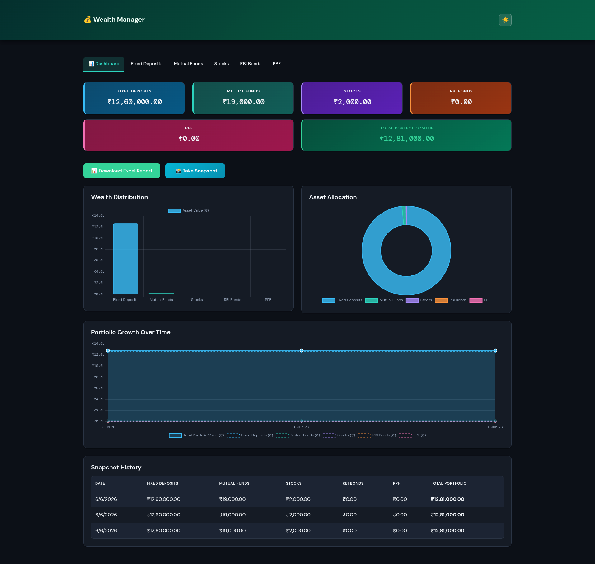

# Wealth Manager - Finance Asset Tracker

A comprehensive Docker-based web application for tracking and managing your finance assets including fixed deposits, mutual funds, stocks, RBI bonds, and PPF contributions.

## Features

- **Fixed Deposits**: Track bank deposits with interest rates and maturity dates
- **Mutual Funds**: Monitor fund investments with NAV tracking
- **Stocks**: Keep track of stock holdings with current and purchase prices
- **RBI Bonds**: Manage sovereign gold bonds, floating rate bonds, and RBI taxable bonds
- **PPF**: Track Public Provident Fund contributions and maturity
- **Portfolio Summary**: Live dashboard showing total asset values
- **Charts**: Asset allocation and wealth distribution visualizations
- **Responsive Design**: Works on desktop and mobile devices

## Wealth Manager Dashboard



## Architecture

```
wealth_manager/
├── docker-compose.yml          # Docker compose configuration
├── Dockerfile.backend          # Backend Flask application
├── Dockerfile.frontend         # Frontend Nginx server
├── backend/
│   ├── app.py                  # Flask API server
│   └── requirements.txt         # Python dependencies
├── frontend/
│   ├── index.html              # Main HTML page
│   ├── nginx.conf              # Nginx configuration
│   ├── css/
│   │   └── style.css           # Styling
│   └── js/
│       └── app.js              # Frontend JavaScript
└── data/                        # SQLite database storage
```

## Services

### Backend (Flask API)
- **Port**: 5000
- **Container**: wealth-manager-backend
- **Database**: SQLite (stored in `/data` volume)
- **Features**:
  - RESTful API endpoints for all asset types
  - CORS enabled for frontend communication
  - Automatic database initialization

### Frontend (Nginx)
- **Port**: 8080
- **Container**: wealth-manager-frontend
- **Features**:
  - Responsive Bootstrap UI
  - Tabbed interface for different asset types
  - Live UI updates after adding or editing assets
  - Currency formatting for Indian Rupee (₹)

## Getting Started

### Prerequisites
- Docker
- Docker Compose
- Modern web browser

### Installation & Running

1. **Clone or navigate to the project directory**:
   ```bash
   cd /path/to/wealth_manager
   ```

2. **Build and start the containers**:
   ```bash
   docker-compose up --build
   ```

   The containers will start and initialize the database automatically.

3. **Access the application**:
   - Open your web browser and go to: `http://localhost:8080`

4. **Stop the application**:
   ```bash
   docker-compose down
   ```

## Usage

### Adding Assets

1. **Fixed Deposits**
   - Navigate to "Fixed Deposits" tab
   - Enter bank name, principal amount, interest rate, tenure, and maturity date
   - Click "Add Fixed Deposit"

2. **Mutual Funds**
   - Go to "Mutual Funds" tab
   - Fill in fund name, number of units, NAV, and purchase date
   - Click "Add Mutual Fund"

3. **Stocks**
   - Select "Stocks" tab
   - Enter stock details (name, symbol, quantity, prices, purchase date)
   - View gain/loss calculations
   - Click "Add Stock"

4. **RBI Bonds**
   - Open "RBI Bonds" tab
   - Choose bond type and enter details
   - Click "Add RBI Bond"

5. **PPF**
   - Go to "PPF" tab
   - Enter account number, financial year, contribution amount, rate, and maturity year
   - Click "Add PPF Contribution"

### Portfolio Summary

The summary card at the top shows:
- Total Fixed Deposits value
- Total Mutual Funds value
- Total Stocks value
- Total RBI Bonds value
- Total PPF value
- **Total Portfolio Value** (sum of all assets)

Data refreshes on page load and immediately after adding or updating assets.

## API Endpoints

### Fixed Deposits
- `GET /api/fixed-deposits` - Get all fixed deposits
- `POST /api/fixed-deposits` - Add new fixed deposit

### Mutual Funds
- `GET /api/mutual-funds` - Get all mutual funds
- `POST /api/mutual-funds` - Add new mutual fund

### Stocks
- `GET /api/stocks` - Get all stocks
- `POST /api/stocks` - Add new stock

### RBI Bonds
- `GET /api/rbi-bonds` - Get all RBI bonds
- `POST /api/rbi-bonds` - Add new RBI bond

### PPF
- `GET /api/ppf` - Get all PPF contributions
- `POST /api/ppf` - Add new PPF contribution

### Portfolio
- `GET /api/portfolio-summary` - Get portfolio summary totals

### Health
- `GET /api/health` - Check backend health

## Data Storage

The application uses SQLite database stored in the `data/` volume. This ensures:
- Data persists between container restarts
- Easy backup and migration
- No external database setup required

### Database Tables
- `fixed_deposits` - Fixed deposit records
- `mutual_funds` - Mutual fund investments
- `stocks` - Stock holdings
- `rbi_bonds` - RBI bond investments
- `ppf` - PPF contributions

## Troubleshooting

### Application not accessible
- Ensure Docker and Docker Compose are installed
- Check if ports 5000 and 8080 are available
- Run `docker-compose logs` to view error messages

### Backend connection errors
- Wait a few seconds for backend to initialize
- Check if backend container is running: `docker-compose ps`
- Review backend logs: `docker-compose logs backend`

### Database issues
- Delete the `data/` folder to reset the database
- Ensure proper file permissions in the data directory

## Development

### Modifying Frontend
1. Edit files in `frontend/` directory
2. Rebuild: `docker-compose up --build frontend`

### Modifying Backend
1. Edit files in `backend/` directory
2. Rebuild: `docker-compose up --build backend`

### Adding New Asset Types
1. Create new table in `backend/app.py`
2. Add API endpoints for CRUD operations
3. Update `frontend/index.html` with new tab
4. Add JavaScript handlers in `frontend/js/app.js`

## Future Enhancements

- [ ] User authentication and accounts
- [ ] Data export to CSV/PDF
- [ ] Performance analytics
- [ ] Goal tracking
- [ ] Recurring transactions
- [ ] Mobile app
- [ ] Real-time stock price integration
- [ ] Tax calculation reports
- [ ] Budget planning tools

## License

This project is open source and available for personal use.

## Support

For issues, feature requests, or contributions, please refer to the project repository.

---

**Happy Wealth Tracking! 💰**
